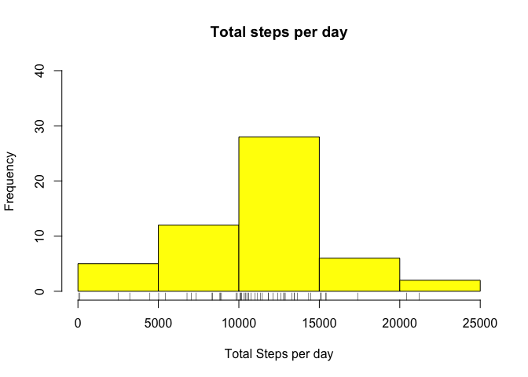
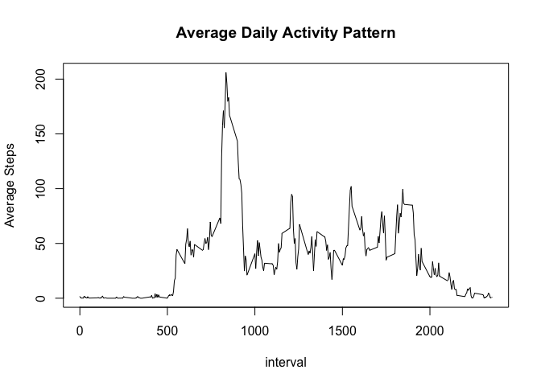
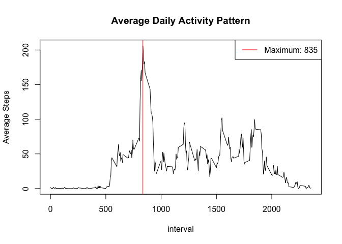
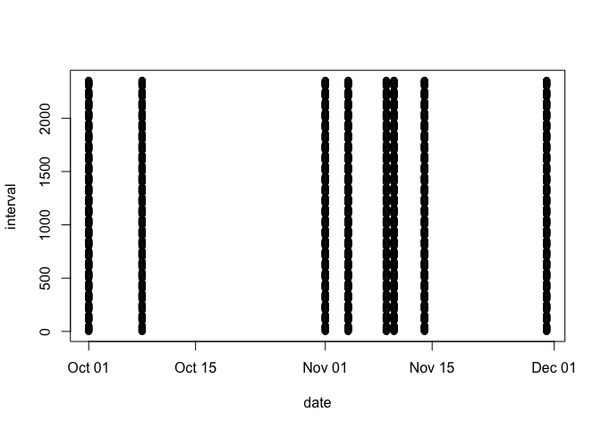
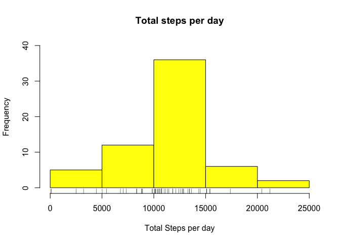
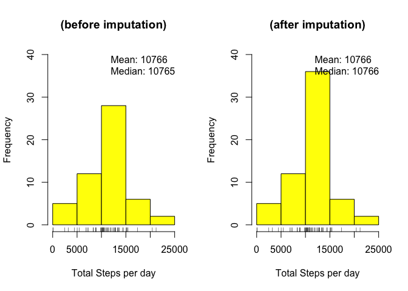
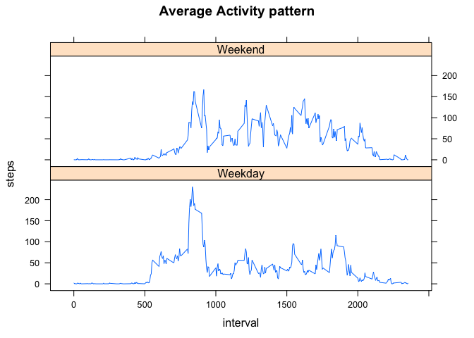

### <span style="color: brown">Introduction</span>
It is now possible to collect a large amount of data about personal movement using activity monitoring devices such as a **Fitbit**, **Nike Fuelband**, or **Jawbone Up**. These type of devices are part of the "quantified self" movement -- a group of enthusiasts who take measurements about themselves regularly to improve their health, to find patterns in their behavior, or because they are tech geeks. But these data remain under-utilized both because the raw data are hard to obtain and there is a lack of statistical methods and software for processing and interpreting the data.

This assignment makes use of data from a personal activity monitoring device. This device collects data at 5 minute intervals through out the day. The data consists of two months of data from an anonymous individual collected during the months of October and November, 2012 and include the number of steps taken in 5 minute intervals each day.

### <span style="color: brown">Structure of the Data</span>
The schema of this dataset is:  


 * **steps**: Number of steps sampled in a 5-minute interval(missing values are represented with NAs).
 * **date**: The date on which the measuremet was taken.
 * **interval**: identifier of the interval in which measurement was taken.

*The data is stored in a csv file:* **activity.zip**

### <span style="color: brown">We will be performing the following tasks, and drawing inferences:</span>

- **Section 1: Loading and preprocessing the data**

- **Section 2: Histogram of the total number of steps taken each day**

- **Section 3: Mean and median number of steps taken each day **

- **Section 4: What is the average daily activity pattern?(Time series plot)**

- **Section 5: The 5-minute interval that, on average, contains the maximum number of steps**

- **Section 6: Imputing missing values**

- **Section 7: Histogram of the total number of steps taken each day after missing values are imputed**

- **Section 8: Panel plot comparing the average number of steps taken per 5-minute interval across weekdays and weekends**  


### <span style="color: brown">Section 1: Loading and preprocessing the data</span>

We begin the analysis by first setting up the environment by:  

- 1. clearing out the environemt
- 2. loading the dplyr, lattice libraries

```r
rm(list = ls())
library(dplyr)
```

```
## 
## Attaching package: 'dplyr'
```

```
## The following objects are masked from 'package:stats':
## 
##     filter, lag
```

```
## The following objects are masked from 'package:base':
## 
##     intersect, setdiff, setequal, union
```

```r
library(lattice)
```

We then begin to load the data from the zipped file **activity.zip**  
We make use of the **unz()** function in **read.csv** to read the file without unzipping it.  

* **Then we view the basic structure of the data:** 


```r
###=========================== Loading and preprocessing the data
datatoanalyze <- read.csv(unz("activity.zip", "activity.csv"), header = TRUE)
#Step1:Basic structure of the data:-
str(datatoanalyze)
```

```
## 'data.frame':	17568 obs. of  3 variables:
##  $ steps   : int  NA NA NA NA NA NA NA NA NA NA ...
##  $ date    : Factor w/ 61 levels "2012-10-01","2012-10-02",..: 1 1 1 1 1 1 1 1 1 1 ...
##  $ interval: int  0 5 10 15 20 25 30 35 40 45 ...
```


* **Preprocess dates from character to date type: **

```r
#Step2:Preprocess the data:-
datatoanalyze$date <- as.Date(datatoanalyze$date)
str(datatoanalyze)
```

```
## 'data.frame':	17568 obs. of  3 variables:
##  $ steps   : int  NA NA NA NA NA NA NA NA NA NA ...
##  $ date    : Date, format: "2012-10-01" "2012-10-01" ...
##  $ interval: int  0 5 10 15 20 25 30 35 40 45 ...
```


### <span style="color: brown">Section 2: Histogram of the total number of steps taken each day </span> 

```r
###=========================== Plot the histogram of Total number of steps taken each day:-
histogramdata <- group_by(datatoanalyze, date)
histogramdata <- summarise_at(histogramdata, .vars = c("steps"),sum)
hist(histogramdata$steps, xlab = "Total Steps per day", col = "yellow", main  ="Total steps per day", ylim = c(0,40))
rug(histogramdata$steps) 
```

<!-- -->

```r
medianValue <- median(histogramdata$steps, na.rm = TRUE)
meanValue <- as.integer(round(mean(histogramdata$steps, na.rm = TRUE), digits = 0))
```

  

#### Code breakdown:
- *Line 1: groups items in dataset by date groupings.*
- *Line 2: Calculates the sum of steps, broken down by date groupings.*
- *Line 3: Draws the histogram.*
- *Line 4: Draws a rug underneath, to show the concentration of data.*
- *Line 5 & 6: Calculate the mean and median of this histogram*  

#### <span style="color:red">Inference:<span>    
From the histogram it can be observed that: 

- The largest occurences of steps taken per day seems to occur more often in the range of 10000 to 15000 steps  

- So it looks like the subject being observed walks around 10000 to 15000 steps on a normal basis.

### <span style="color: brown">Section 3: Mean and median number of steps taken each day each day </span> 

From the histogram code, lines5 and line6 calculate the mean and median respectively. 


```r
medianValue <- median(histogramdata$steps, na.rm = TRUE)
meanValue <- as.integer(round(mean(histogramdata$steps, na.rm = TRUE), digits = 0))
```

**The mean is:** 10766  
**The median is :** 10765  

### <span style="color: brown">Section 4: What is the average daily activity pattern?(Time series plot) </span> 

The next plot is going to show, what is the average activity of our subject measured by the number of steps. This will give insight as to when the subject is more active and moving out and about on a typical day.


```r
###=========================== What is the average daily activity pattern?
activitypattern <- group_by(datatoanalyze,interval)
activitypattern <- summarize_at(activitypattern, .vars = c("steps"),mean, na.rm = TRUE)
with(activitypattern, plot(interval,steps, type = "l", col = "black", ylab = "Average Steps",main = "Average Daily Activity Pattern"))
```

<!-- -->

#### Code breakdown:
- *Line 1: groups items in dataset by interval groupings.*
- *Line 2: Calculates the sum of steps, broken down by interval groupings.*
- *Line 3: Draws a time series plot*

#### <span style="color:red">Inference:<span> 
From the plot, it looks like our subject is most active between the 600 to 1000 interval.  

### <span style="color: brown">Section 5: The 5-minute interval that, on average, contains the maximum number of steps </span> 

We now look at which particular interval has the maximum number os steps.  
This is relevant as it shows when our subject usually moves about the most.


```r
activitypattern <- group_by(datatoanalyze,interval)
activitypattern <- summarize_at(activitypattern, .vars = c("steps"),mean, na.rm = TRUE)
with(activitypattern, plot(interval,steps, type = "l", col = "black", ylab = "Average Steps",main = "Average Daily Activity Pattern"))

maximumSteps <- max(activitypattern$steps)
intervalwithMaximumSteps <- activitypattern[grep(maximumSteps,activitypattern$steps),"interval"]
abline(v = intervalwithMaximumSteps, col = "red")
legend("topright",legend = c(paste("Maximum:",intervalwithMaximumSteps)),col = c("red"),lty = 1)
```

<!-- -->

#### Code breakdown:
- *Line 1 -3 : Same as before, this just generates the average daily activity*
- *Line 4: Calculates the max value of steps walked*
- *Line 5: Searches for the row in the data set with max steps walked and returns it's corresnponding interval*
- *Line 6: Draws a vertical line on the plot at the interval where max steps occur*
- *Line 7: Draws a legend, with Maximum interval displayed inside it*

#### <span style="color:red">Inference:<span> 
From the plot, with the line, we see that **835** is the interval when, the subject is most active as measured by the steps taken.  

### <span style="color: brown">Section 6: Imputing missing values</span>  
Imputing is a technique of replacing missing values in a dataset with appropriate values, that approximate, what could probably have been the missing value.  

**Why do we need to impute values for our dataset?**

```r
summary(datatoanalyze)
```

```
##      steps             date               interval     
##  Min.   :  0.00   Min.   :2012-10-01   Min.   :   0.0  
##  1st Qu.:  0.00   1st Qu.:2012-10-16   1st Qu.: 588.8  
##  Median :  0.00   Median :2012-10-31   Median :1177.5  
##  Mean   : 37.38   Mean   :2012-10-31   Mean   :1177.5  
##  3rd Qu.: 12.00   3rd Qu.:2012-11-15   3rd Qu.:1766.2  
##  Max.   :806.00   Max.   :2012-11-30   Max.   :2355.0  
##  NA's   :2304
```

- There are **2304**  missing steps in our data set.  

- Therefore the need arises to figure out what those values are.  

Let us now investigate the frequency of occurence of these missing values.  

```r
missingValueData <- datatoanalyze[is.na(datatoanalyze$steps),]

with(missingValueData, plot(date,interval))
```

<!-- -->

*There seem to be 8 days with missing values. The interval of missing values span the entire sampling period. This seems to imply that maybe the sensor for measuring the subjects activity was broken.*  

*However, these days are too few in number, and can be easily replaced with the mean value , of activity at each of the intervals for these days.*

**The imputation process**  

*Step1: separate dataframe into: dataframe with NA steps;  dataframe with Non-NA steps*

```r
#Step1: separate dataframe into: dataframe with NA steps;  dataframe with Non-NA steps
onlyNonNAData <- datatoanalyze[!is.na(datatoanalyze$steps),]
onlyNAData <- datatoanalyze[is.na(datatoanalyze$steps),]
```

*Step2: get intervals inside the dataframe of NA steps*

```r
#Step2: get intervals inside the dataframe of NA steps
listtotraverse <- unique(onlyNAData$interval)
listtotraverse
```

```
##   [1]    0    5   10   15   20   25   30   35   40   45   50   55  100  105  110
##  [16]  115  120  125  130  135  140  145  150  155  200  205  210  215  220  225
##  [31]  230  235  240  245  250  255  300  305  310  315  320  325  330  335  340
##  [46]  345  350  355  400  405  410  415  420  425  430  435  440  445  450  455
##  [61]  500  505  510  515  520  525  530  535  540  545  550  555  600  605  610
##  [76]  615  620  625  630  635  640  645  650  655  700  705  710  715  720  725
##  [91]  730  735  740  745  750  755  800  805  810  815  820  825  830  835  840
## [106]  845  850  855  900  905  910  915  920  925  930  935  940  945  950  955
## [121] 1000 1005 1010 1015 1020 1025 1030 1035 1040 1045 1050 1055 1100 1105 1110
## [136] 1115 1120 1125 1130 1135 1140 1145 1150 1155 1200 1205 1210 1215 1220 1225
## [151] 1230 1235 1240 1245 1250 1255 1300 1305 1310 1315 1320 1325 1330 1335 1340
## [166] 1345 1350 1355 1400 1405 1410 1415 1420 1425 1430 1435 1440 1445 1450 1455
## [181] 1500 1505 1510 1515 1520 1525 1530 1535 1540 1545 1550 1555 1600 1605 1610
## [196] 1615 1620 1625 1630 1635 1640 1645 1650 1655 1700 1705 1710 1715 1720 1725
## [211] 1730 1735 1740 1745 1750 1755 1800 1805 1810 1815 1820 1825 1830 1835 1840
## [226] 1845 1850 1855 1900 1905 1910 1915 1920 1925 1930 1935 1940 1945 1950 1955
## [241] 2000 2005 2010 2015 2020 2025 2030 2035 2040 2045 2050 2055 2100 2105 2110
## [256] 2115 2120 2125 2130 2135 2140 2145 2150 2155 2200 2205 2210 2215 2220 2225
## [271] 2230 2235 2240 2245 2250 2255 2300 2305 2310 2315 2320 2325 2330 2335 2340
## [286] 2345 2350 2355
```
*Step 3:*  

- *Impute the missing values by filling in  with (means for the 5-minute intervals)*  

*Do this by:*  

- *Go through the listtotraverse, by interval, adding in the (means for the 5-minute intervals)*  


```r
#Step 3:
#Impute the missing values by filling in  with (means for the 5-minute intervals)
#Do this by:
#Go through the listtotraverse, by interval, adding in the (means for the 5-minute intervals)
#Add the newly imputed values into a newdataframeimputed

for(val in listtotraverse)
{
  onlyNAData[onlyNAData$interval == val,"steps"] <- activitypattern[activitypattern$interval == val,"steps"]
}
```

*Add the newly imputed values into a newdataframeimputed*

```r
#Combine imputed onlyNAData frame and onlyNonNAData frame to create the newly imputed dataset
newimputedDataframe <- rbind(onlyNonNAData,onlyNAData)
head(newimputedDataframe)
```

```
##     steps       date interval
## 289     0 2012-10-02        0
## 290     0 2012-10-02        5
## 291     0 2012-10-02       10
## 292     0 2012-10-02       15
## 293     0 2012-10-02       20
## 294     0 2012-10-02       25
```


#### <span style="color:red">Imputation Result:<span>  
*The final result is replacing all* **NAs** *with* **average(mean) steps for that interval**  


### <span style="color: brown">Section 7: Histogram of the total number of steps taken each day after missing values are imputed</span> 

Now we plot the histogram, for distribution of total steps taken by the subject.  
The code is the same as what we used in **Section 2**  


```r
###==================Histogram of the total number of steps taken each day after missing values are imputed

# Plot: The histogram with imputed data
histogramdata1 <- group_by(newimputedDataframe, date)
histogramdata1 <- summarise_at(histogramdata1, .vars = c("steps"),sum)
hist(histogramdata1$steps, xlab = "Total Steps per day", col = "yellow", main  ="Total steps per day", ylim = c(0,40))
rug(histogramdata1$steps)
```

<!-- -->

```r
meanValue <- round(mean(histogramdata1$steps, na.rm = TRUE), digits = 0)
medianValue <- median(histogramdata1$steps, na.rm = TRUE)
```

**We now plot a side by side comparison of histograms between non-imputed Versus imputed**

```r
#Plot: Histogram of Non-imputed , imputed data side by side. (1 row and 2 columns) layout
par(mfrow = c(1,2))
histogramdata <- group_by(datatoanalyze, date)
histogramdata <- summarise_at(histogramdata, .vars = c("steps"),sum)
hist(histogramdata$steps, xlab = "Total Steps per day", col = "yellow", main  ="(before imputation)", ylim = c(0,40))
rug(histogramdata$steps)
meanValue <- round(mean(histogramdata$steps, na.rm = TRUE), digits = 0)
medianValue <- round(median(histogramdata$steps, na.rm = TRUE),digits = 0)
legend("topright",legend = c(paste("Mean:",meanValue),paste("Median:",medianValue)),bty = "n")

histogramdata1 <- group_by(newimputedDataframe, date)
histogramdata1 <- summarise_at(histogramdata1, .vars = c("steps"),sum)
hist(histogramdata1$steps, xlab = "Total Steps per day", col = "yellow", main  ="(after imputation)", ylim = c(0,40))
rug(histogramdata1$steps)
meanValue <- round(mean(histogramdata1$steps, na.rm = TRUE), digits = 0)
medianValue <- round(median(histogramdata1$steps, na.rm = TRUE),digits = 0)
legend("topright",legend = c(paste("Mean:",meanValue),paste("Median:",medianValue)),bty = "n")
```

<!-- -->

#### <span style="color:red">Inference:<span>

- We see there the mean and median become the same after imputation.
- We also observe a considerable increase in observations in the 10000 - 15000 step range.


### <span style="color: brown">Section 8: Panel plot comparing the average number of steps taken per 5-minute interval across weekdays and weekends</span> 

We now proceed to break up the data, into weekdays and weekends to check, if there is any difference in the subjects behaviour interms or how active it is, on weekends versus weekdays.  

We proceed to do that in the following manner:  

```r
newimputedDataframe$date <- as.Date(newimputedDataframe$date)

#Display the days in terms of: Mon,Tue,Wed....., and list out their breakups in a table
daysname <- (weekdays(newimputedDataframe$date,abbreviate = TRUE))
table(daysname)
```

```
## daysname
##  Fri  Mon  Sat  Sun  Thu  Tue  Wed 
## 2592 2592 2304 2304 2592 2592 2592
```

#### Code breakdown:
- *Line 1  : Convert values in date column to date type*
- *Line 2: Convert the dates to the name of their days: Mon, Tue, etc etc*
- *Line 3: Display the breakup of how many Mons, Tues, ... Suns are there in a table*

#### <span style="color:red">Inference:<span>  

- There are 2 X 2304 Weekend days = 4608
- There are 5 x 2592 Weekdays  = 12960 

We now proceed to replace: Sat & Sun with Weekend, Mon-Fri with Weekday

```r
#Replace : (Mon- Fri, with: Weekday), (Sat-Sun, with the name: Weekend)
daysname <- gsub("(Sat|Sun)","Weekend",daysname)
daysname <- gsub("(Mon|Tue|Wed|Thu|Fri)","Weekday",daysname)
table(daysname)
```

```
## daysname
## Weekday Weekend 
##   12960    4608
```

#### Code breakdown:
- *Line 1: greps and subs Sat and Sun with Weekend*
- *Line 2: greps and subs Mon- Fri with Weekdays *
- *Line 3: Display the breakup Weekends and Weekdays*

#### <span style="color:red">Inference:<span> 

- We have now merged the days into 2 levels: Weekend & Weekday
- Weekend is : 4608 days (this makes sense as summing up 2304 Saturdays and 2304 Sundays each gives this total)
- Weekdays is: 12960 days (this makes sense as summing 2592 Mondays, 2592 Tuesdays, 2592 Wednesdays, 2592 Thursdays, 2592 Fridays, gives this total)

We now proceed to add this breakups of Weekends and Weekdays as a new column to our dataset

```r
#Add a new column called day_type to our dataframe:
newimputedDataframe$day_type <- as.factor(daysname)
```


```r
#Group data by day_type(Weekend/Weekday), then group by Interval
newimputedDataframe <- group_by(newimputedDataframe,day_type)
newimputedDataframe <- group_by(newimputedDataframe,interval,add=TRUE)
```
#### Code breakdown:
- *Line 1: group data by weekends/weekdays based on the newly added column*
- *Line 2: group data based on the interval *

Create a summary, that gives average steps: broken by interval, and grouped by weekend/weekday

```r
activitypattern1 <- summarize_at(newimputedDataframe, .vars = c("steps"),mean, na.rm = TRUE)
```

Finally, create a panel plot of: average activity, broken by weekend and weekday

```r
#Create the panel plot, for activity pattern for; Weekend/ Weekday
xyplot(steps~interval|day_type, data = activitypattern1, layout= c(1,2), type = "l", main ="Average Activity pattern")
```

<!-- -->

#### <span style="color:red">Inference:<span>  

We infer the following about out subject:

- On Weekdays: The subject seems to be really active beween 600 - 800 interval. The activity data is highly skewed in the beginning of the day and then tapers off.  

- on Weekends: There seems to be a uniform distribution of activity,  the subject is consistently active over a large window fro, 600 - 2000. The activity data is more uniformly distributed with no noticable peaks.
